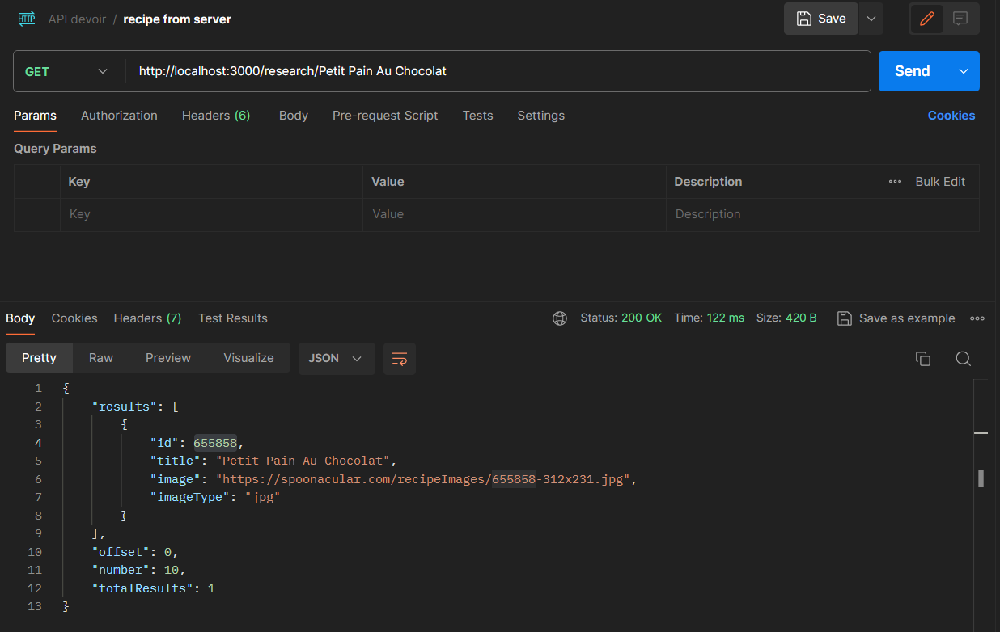
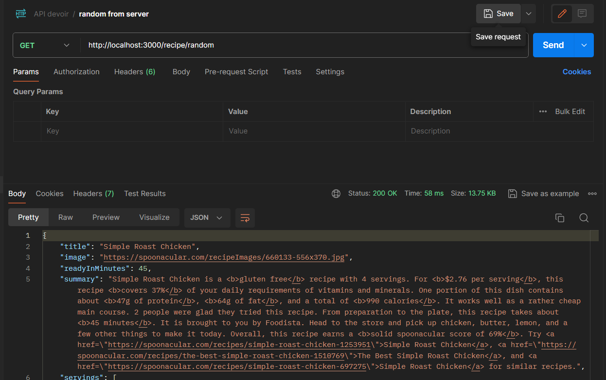
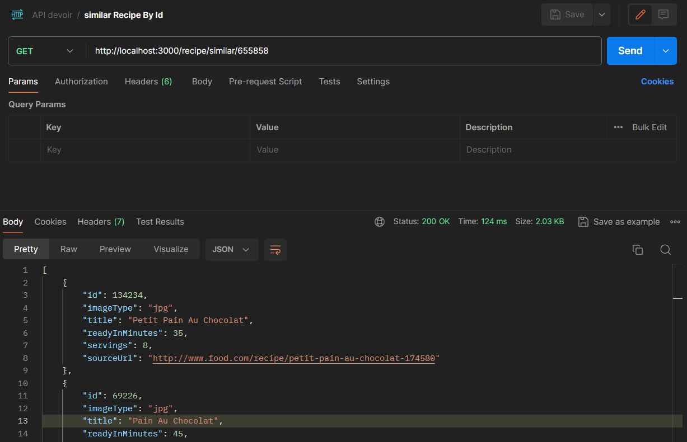

# RECIPE PROJECT 

#### Ce projet a pour but de permettre la recherche de recette a l'aide de requete faite a l'api. 

## Fonctionalité
- Recherche de recette par nom 
- Recherche d'une recette aléatoire 
- Recherche d'une recette similaire à une autre 

## Instruction d'instalation 
1. Clonnez le depôt : `https://github.com/JoalanM/RecipeApi.git`
2. Créer un repository local
3. Aller dans le repertoire `Back`
3. installer les dépendance : `npm install`
4. lancer l'applicatiopn : ` npm start`

## Configuration requise 
- clé api sur le site [spoonacular](https://spoonacular.com/food-api)


## Exemple d'utilisation 
### Exemple 1 : Recherche d'une recette
```bash 
    `http://localhost:3000/research/:recipe`
```


### Exemple 2 : Recherche d'une recette aléatoire
```bash 
    `hhttp://localhost:3000/recipe/random`
```


### Exemple 3 : Recherche d'une recette similaire à une autre
```bash 
    `hhttp://localhost:3000/recipe/similar/:idRecipe`
```


[Documentaiton officelle de l'api recette](https://spoonacular.com/food-api/docs)


